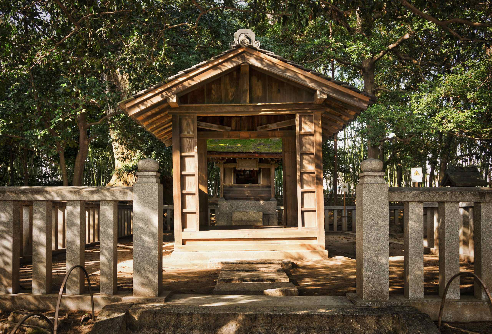
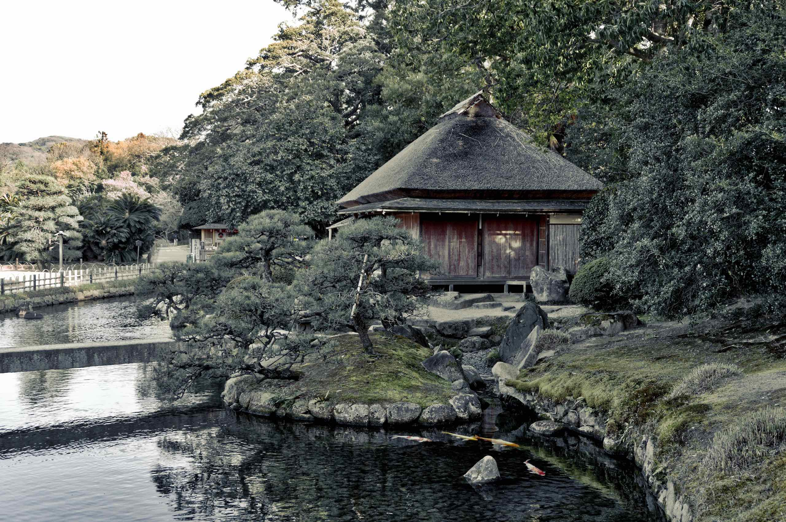
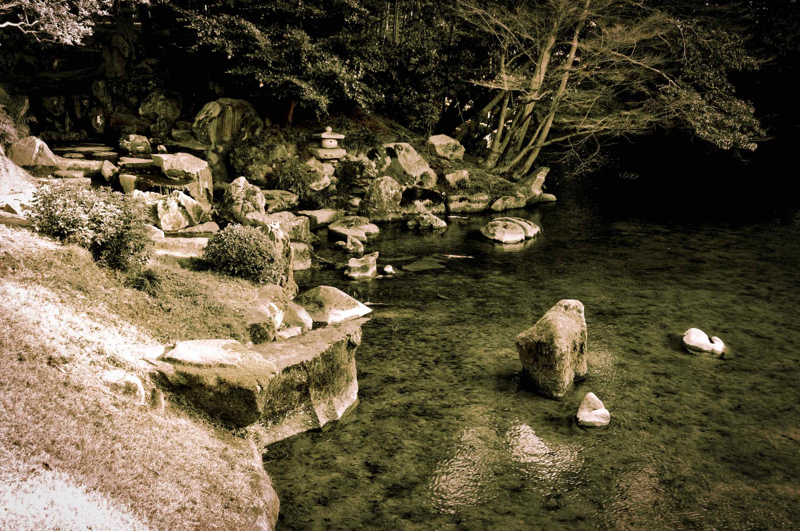

We decided to visit the Kōraku-en (後楽園) garden in Okayama next to the castle. It is one of the Three Great Gardens of Japan (along with Kenroku-en and Kairaku-en).

The garden was completed in 1700 (after Okayama Castle). The original appearance has survived until today in more, with a few changes made along the way.

The design is designed in the Kaiyu (“scenic promenade”) style. Every turn of the path presents the visitor with a unique view, connecting the lawns, ponds, hills, tea houses, and streams.

In addition, and rather unique for a Japanese garden, there are spacious lawns. Also found in the garden are groves of plum, cherry and maple trees, tea and rice fields, an archery range and a crane aviary.

From Yuishinzan Hill, there is an observation platform where it is possible to command a panoramic view of the garden.
Korakuen garden contains a number of buildings:

- Enyo-tei House
- Jizo-do Shrine
  
- Ryuten rest house
- Jigen-do Shrine
  
- Noh stage and Eisho
- Renchi-ken rest house
  
- Chaso-do tea house

From some parts of the garden, Okayama Castle can be observed in the distance.

The main pond (Sawa-no-ike) contains a number of artificial and decorative islands. In addition, there are smaller ponds:

- Kayo-no-ike
  
- Kawa-no-ike
  

Korakuen garden is lovely but the trees haven’t blossomed here either. It looks like we missed the cherry blossom by about two weeks – darn.

The [main website](https://okayama-korakuen.jp/) of the garden also includes an [English section](https://okayama-korakuen.jp/section/english/). Although the Okayama Prefectural Museum is located next to the garden, but we did not visit as there simply wasn’t enough time.
