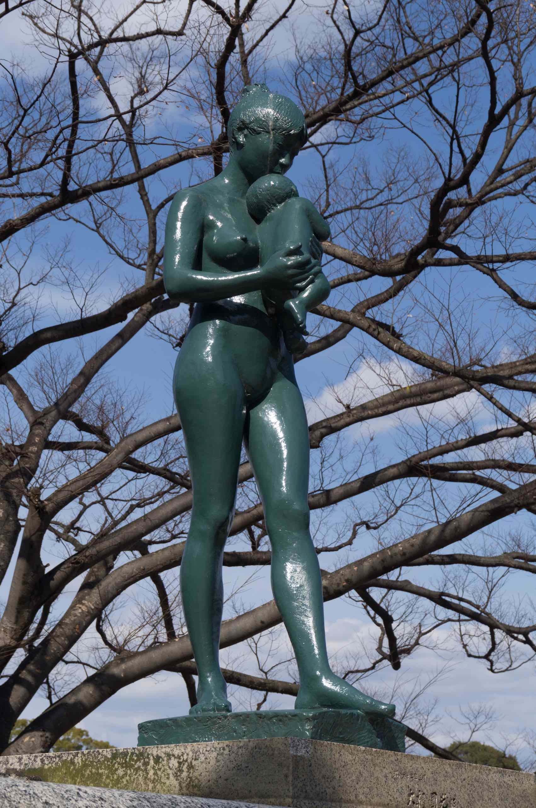

Okayama (岡山市) is the capital city of Okayama Prefecture

## Dinner and shopping

After visiting the castle and the garden, we wandered around the commercial heart of Okayama. We saw a cute bus with a Rilakkuma motif. I was very tempted to board it but did not know where it went.

We are searching for a good place to have dinner before turning it in for the night.

Along the way, we passed through a park. I saw a striking green statue of a naked woman and a child.

For dinner we tried searching for a yakitori place recommended by our travel guide but couldn’t find it. Then we searched for an okonomiyaki place but couldn’t find that either. Maybe they have closed down. It’s weird because the [official tourist guide in English](https://www.okayama-japan.jp/en/) has a prominent banner linking to the Michelin Guide.

We finally settled for a ramen place called Hishio. The Cha shu (roast pork) there was fabulous – the stock was also unusual.

Okayama is a fairly large city and even features a professional symphony orchestra, the Okayama Symphony Orchestra. We passed by the Okayama Symphony Hall.

After dinner I wandered around BIC Camera. As a sign of the times, BIC Camera used to sell nothing but cameras. But now, despite having 4 floors, they seem to sell almost everything but cameras. I ogled at the latest high end Sony Walkman but it was too expensive even for me. In addition, I checked out pink camera bags but eventually settled for some pink camera straps. I was pleased to find out they can do the tax free refund on the spot. They also offered another 5% discount for paying with VISA.
