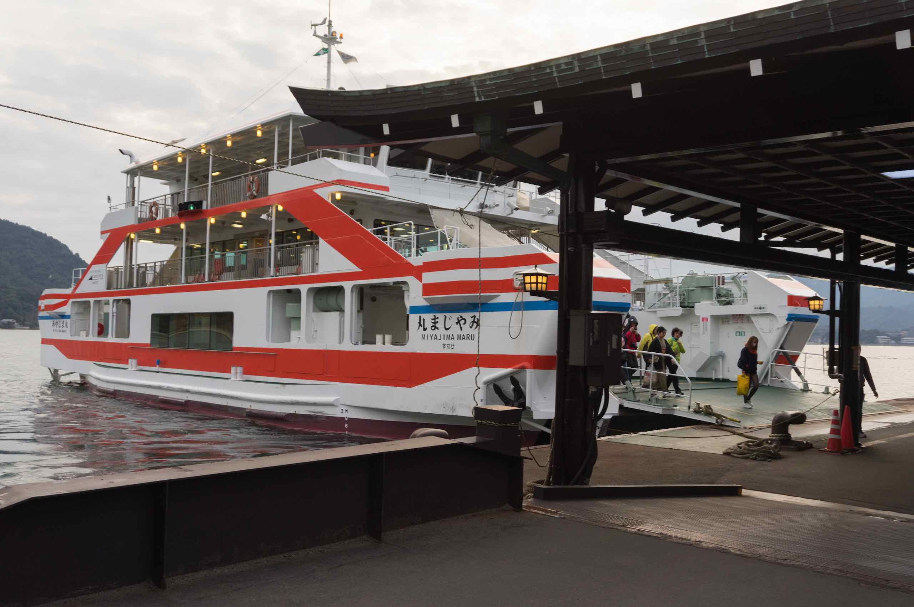
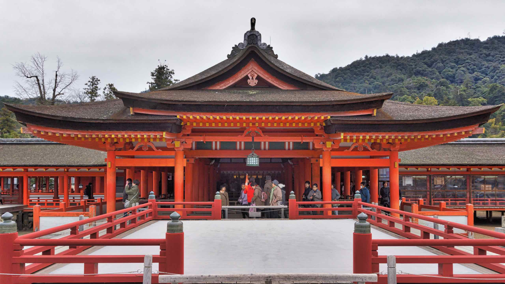

Miyajima (宮島), or "Shrine Island", is an island in the northwest of Hiroshima Bay, part of the Seto Inland Sea of Japan. It's formal name is Itsukushima (厳島).

The famous O-Torii gate is part of Itsukushima Shrine, a UNESCO World Heritage Site.

Itsukushima has a number of temples, including Toyokuni Shrine with a five-storied pagoda, and Daiganji Temple – one of the three most famous Benzaiten temples of Japan.

Seto Inland Sea is affected by strong tides. At low tide, water no longer cover the island’s torii bottom, which can disappoint tourists. At high tide, the sea covers all the previously exposed seabed mud and fills areas underneath the shrine boardwalk.

The tourism guide for Miyajima is available in [English](https://www.miyajima.or.jp/english/).

## Journey to Miyajima

We reached the island via a train ride, then a ferry. Both train and ferry to the island was crowded as we went on a weekend.

Upon arrival, we followed the horde of people heading for Miyajima the shrine and the torii gate built on the shallow sea bed. Unfortunately it was low tide, which somewhat spoils the effect. Still, it was a nice experience.

On the way to the shrine we had to pass streets full of tourist traps – souvenir shops, overpriced food and stalls. The street food looked and smelt amazing – I had to exercise self control but I nearly lost it when I discovered a stall selling Hello Kitty cakes.

Miyajima is also famous for deer wandering around the island. These are pretty tame and obviously trained to listen to the sound of rustling bags. I think the deer were very disappointed we did not have any shika senbei (deer crackers) with us. I managed to pet a few and they are very docile.

## Itsukushima Shrine

The Itsukushima shrine is one of Japan’s most popular tourist attractions. It is most famous for its dramatic gate, or torii on the outskirts of the shrine, the sacred peaks of Mount Misen, extensive forests, and its ocean view. The shrine complex itself consists of two main buildings: the Honsha shrine and the Sessha Marodo-jinja, as well as 17 other different buildings and structures that help to distinguish it. The complex is also a UNESCO World Heritage Site. Six of its buildings and possessions are National Treasures.

