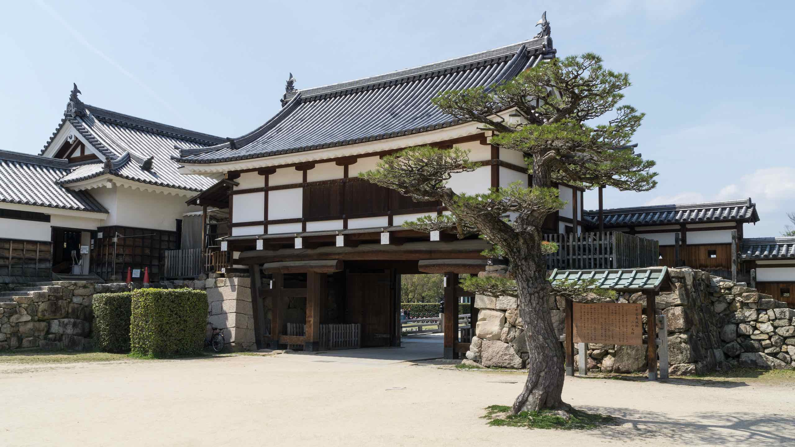
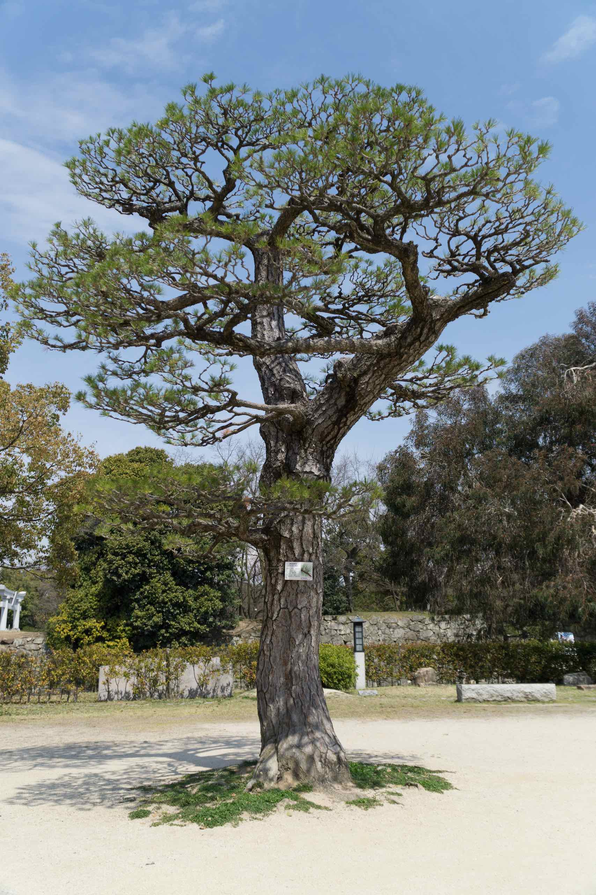
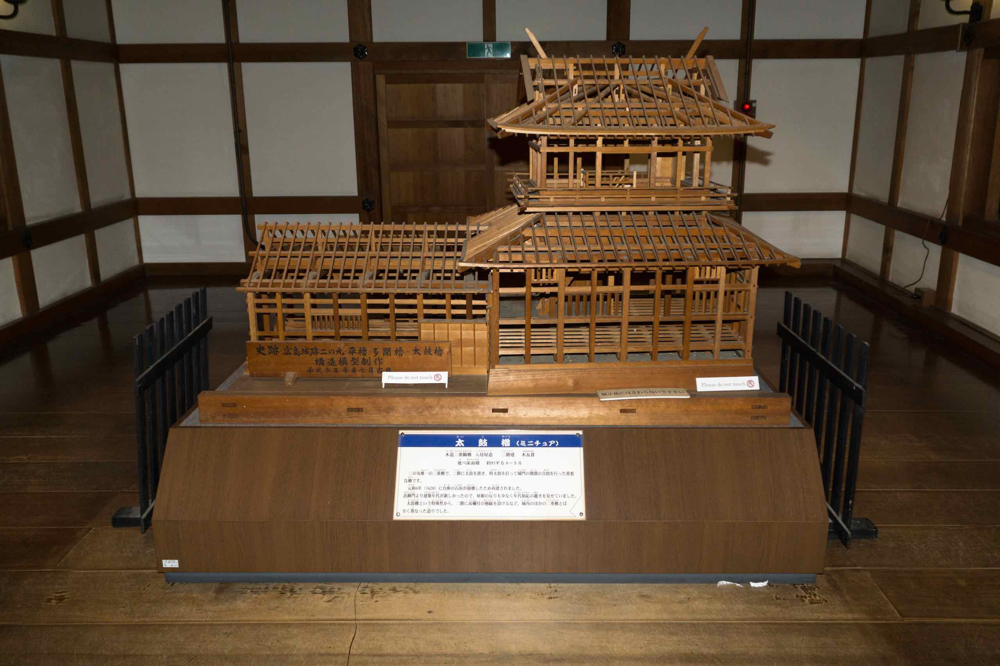
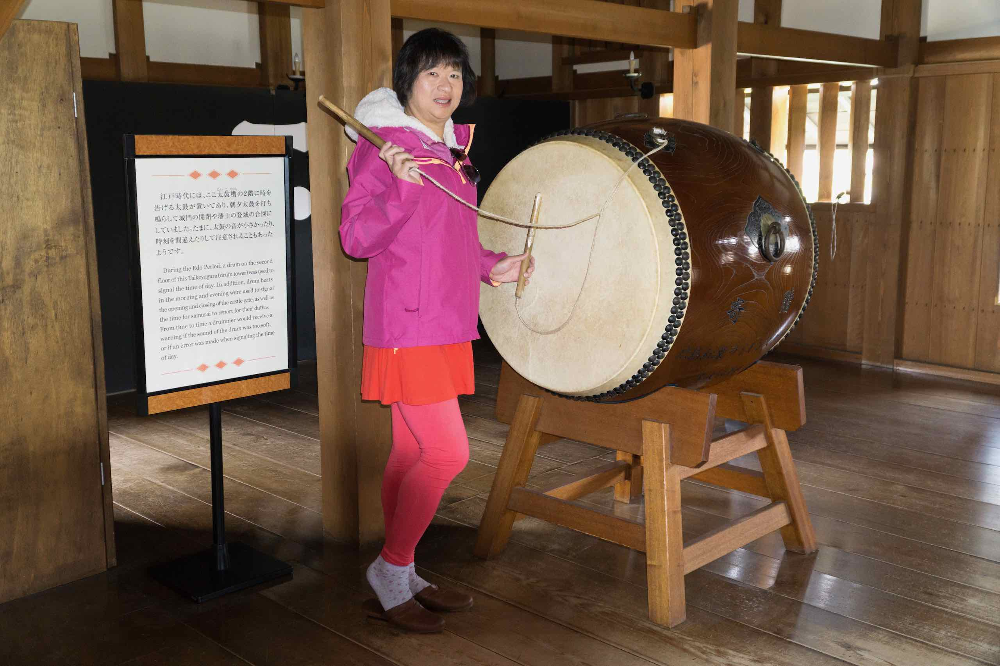
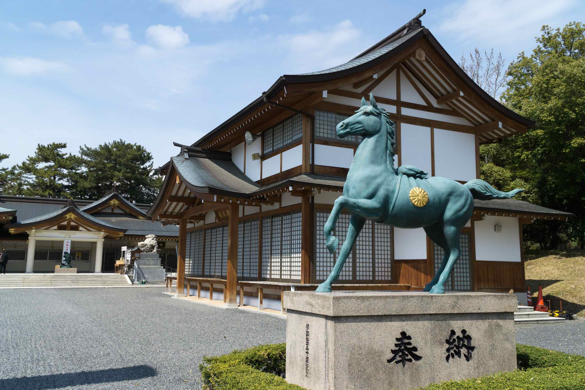

## Hiroshima Castle

Hiroshima Castle (広島城), also called Carp Castle (鯉城), was constructed in the 1590s, but destroyed by the atomic bomb on 1945 and rebuilt in 1958.

Hiroshima Castle is yet another reconstructed castle. The Atomic Bomb destroyed the original castle, along with most of Hiroshima at the end of World War II. Which reminded me … almost everything in Hiroshima is relatively new and constructed post war. They rebuilt the castle quite early, in 1958. The interior now contains a museum of Hiroshima’s history prior to WW2.

The [official website](http://www.rijo-castle.jp/) is unfortunately Japanese only, but you can view a [PDF map](http://www.rijo-castle.jp/RIJO_HP/contents/09_alacarte/pdf/map_en.pdf) of the castle in English.

## Ninomaru

We entered the castle via a bridge to the Main Gate. This is a courtyard containing a museum. Surprisingly, there are two trees here that survived the blast. There is an old willow tree that hasn’t bloomed yet and an old eucalyptus tree.

Inside the museum (free entry) are models of Hiroshima castle and surrounds.

I couldn’t resist posing in front of a taiko drum.

There is also a group of people rehearsing for a samurai performance. They call themselves “Aki Hiroshima Busho-Tai” and they even have a website (in Japanese).

After that, we passed through another bridge into the castle grounds past a ruined gate.

## Hiroshima Castle Inner Grounds

There is a shrine here (Hiroshima Gogoku-Jinja). We stopped by to have a drink from the local souvenir shop.

There are also various ruins, including the Imperial General headquarters. The original castle foundation stones are visible. The reconstructed castle is built on a raised platform.

The castle itself looks like it has a wooden exterior but we didn’t go inside as reconstructed castles always look so fake past the entrance

## Central Park

Leaving the castle, we discovered a European looking statue of naked women on a bed of flowers surrounded by a pond.

From a distance, we can see the castle across the moat.

