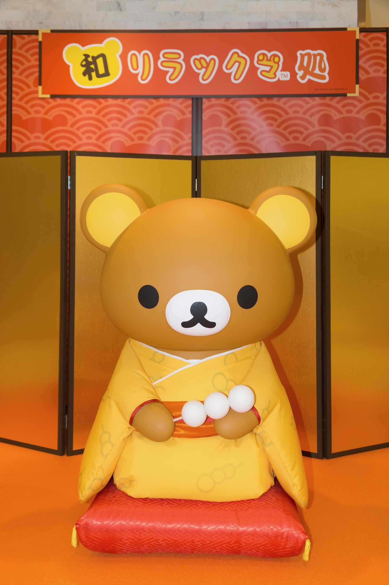
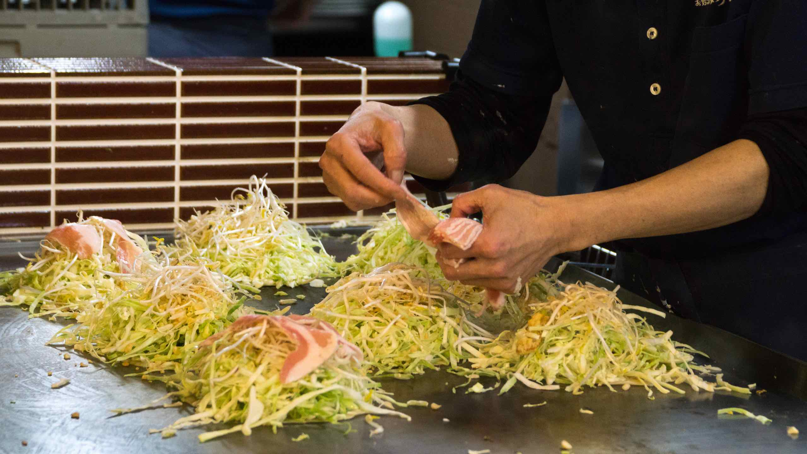
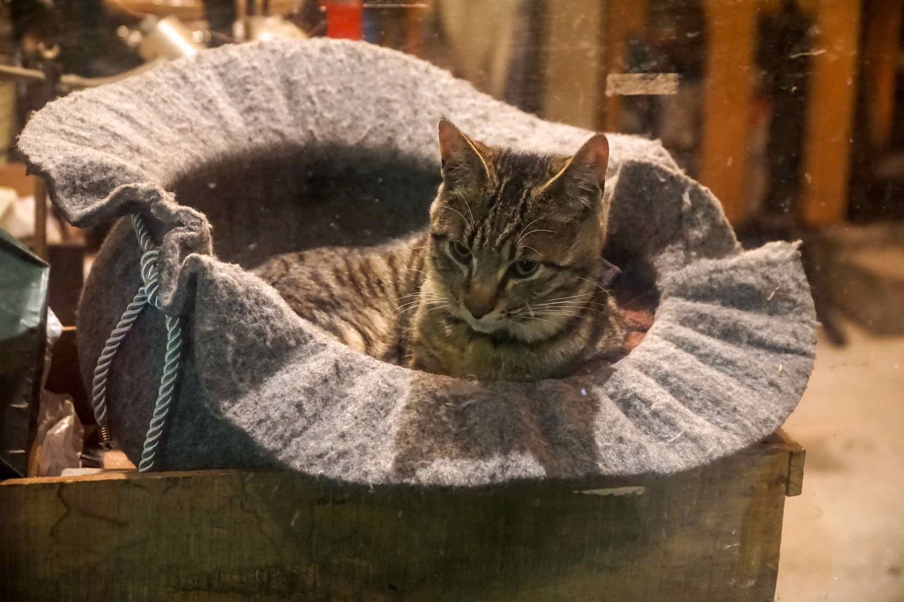

After the Peace Museum, we walked along the Peace Boulevard which had even more sculptures and monuments. We then turned towards Hatchobori, Hiroshima’s main shopping district. We went into a shopping centre called Parco which had a Rilakkuma pop up store and display as well as a Tower Records on the top floor. I bought 宇多田ヒカル’s latest album Fantome there as well as the 20th anniversary remix of her first album.

We then went to Mitchan to sample their okonomiyaki but we arrived just a little too late – there was already a queue and we had to wait nearly an hour before we could get in.

The Hiroshima variant of the okonomiyaki is layered together with noodles so it’s basically a carb fest. I enjoyed mine but it’s not exactly the healthiest meal option.

After dinner, we wandered around the district of "Ekinishi" just to the west of Hiroshima Station,
sandwiched among the high-rises that are gradually taking over the area.

Here there are tiny maze of streets full of tiny restaurants, bars and boutiques. Wandering into Ekinishi is like stepping back in time to the post war period, but it buzzes with energy.

