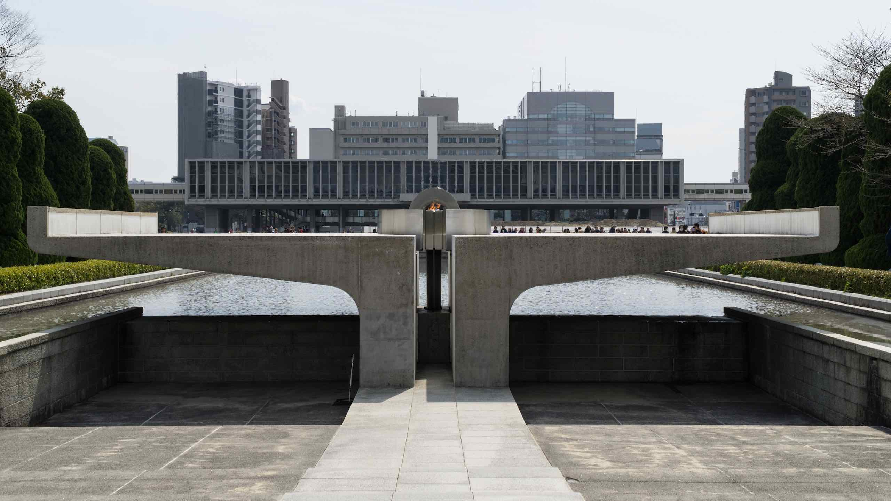
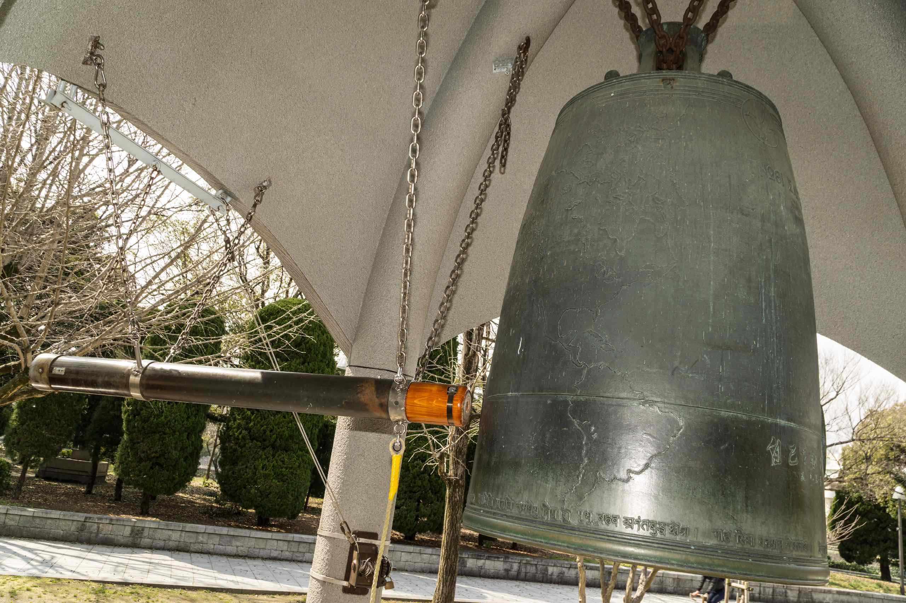
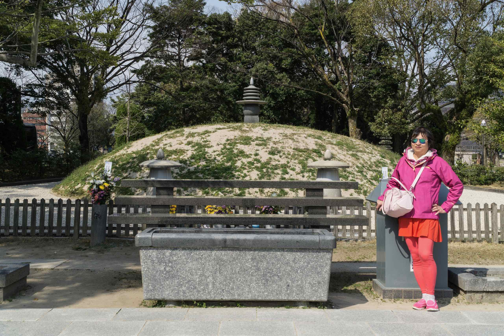
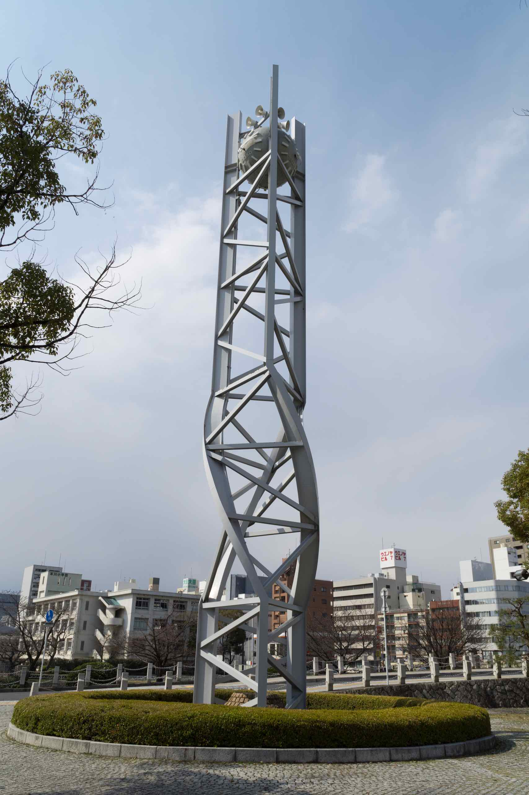
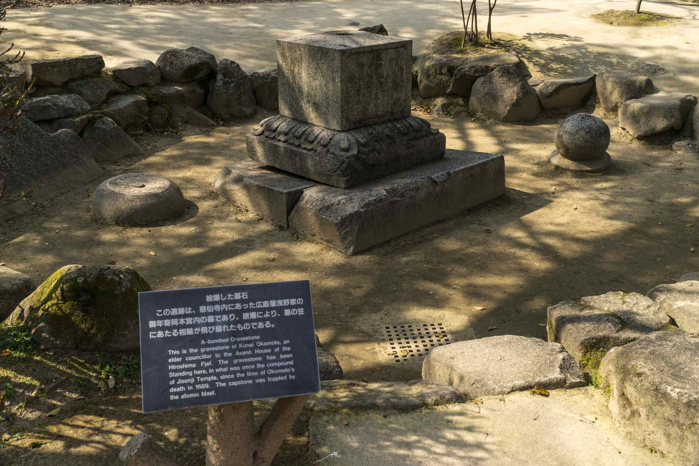
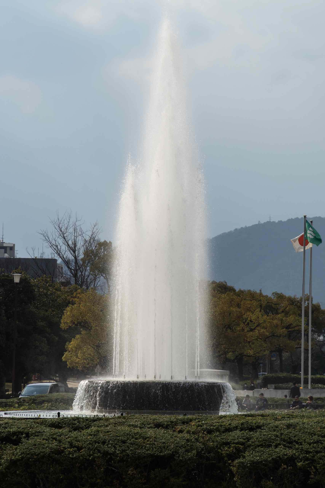
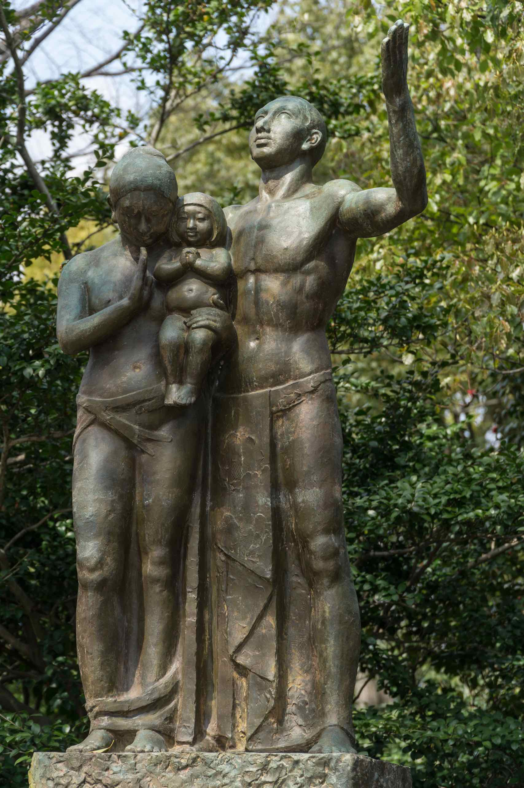
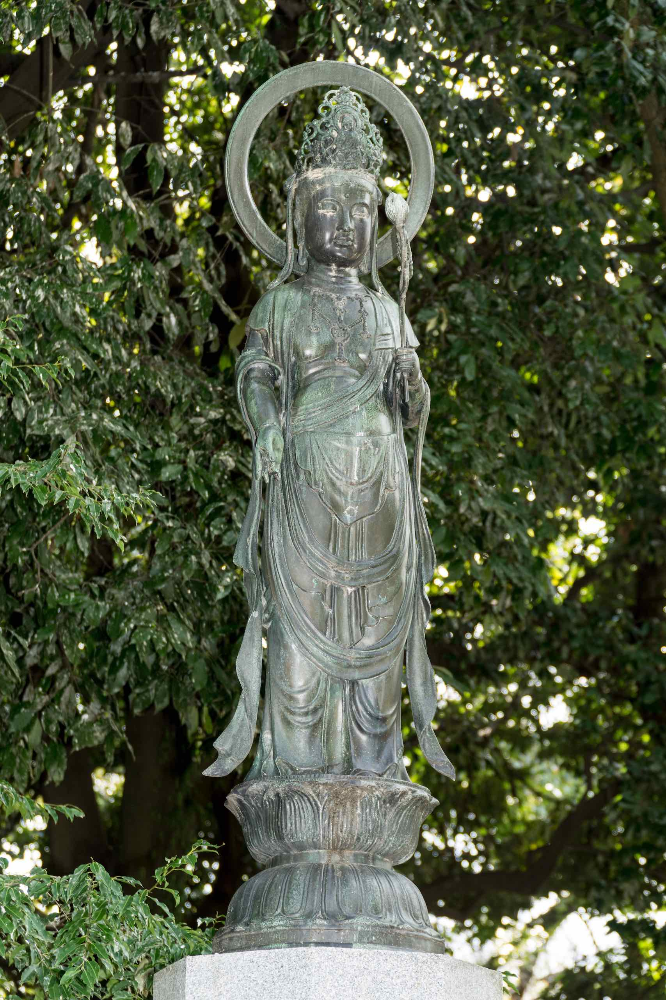

The Hiroshima Peace Park (広島平和記念公園) is a memorial park. It is dedicated to the legacy of Hiroshima as the first city in the world to suffer a nuclear attack, and to the memories of the bomb’s direct and indirect victims (of whom there may have been as many as 140,000). More than one million people each year visit this place.

The Hiroshima Peace Park contains a number of structures which are memorials or dedications to peace. This includes the following:

- Memorial Cenotaph
  
- Peace Flame
  
- Peace Bell
  
- Atomic Bomb Memorial Mound
  
- Cenotaph for Korean victims
  
- Gates of Peace
- Memorial Tower to the Mobilised Students
  
- Pond of Peace
  
- Peace Clock Tower
  
- A-bombed Gravestone
  
- Peace Fountain
  
- Monument of Prayer
  
- Prayer Monument of Peace
- Statue of Merciful Mother
  
- Statue of a Prayer for Peace
- The Figure of the Merciful Goddess of Peace
  

There are apparently many more [memorials](https://en.wikipedia.org/wiki/Hiroshima_Peace_Memorial_Park) but I think you get the idea.

I particularly liked the Hall of Remembrance which has a 14,000 tile 360 degree panorama of Hiroshima after the blast. The Peace Bell somehow seems less impressive than the one in Cowra, possibly because it is overshadowed by far larger and more impressive monuments.

The cenotaph and the peace flame are obviously the centrepiece of the park. Most visitors try to take a picture of themselves here. We also found a few trees surviving the atomic blast in a corner of the park.

I discovered a hilarious Hello Kitty tax free shopping poster near the Rest House. I also noticed a hotel called “High Up” across the street which wasn’t particularly high.
