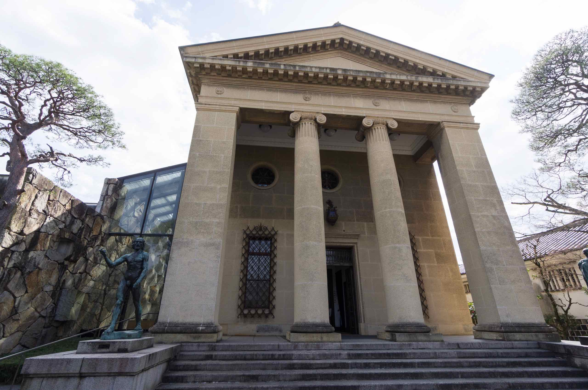

Kurashiki (倉敷市) is a city located in western Okayama Prefecture.

## Bikan Historical Area

Kurashiki has a preserved canal area that dates back to the Edo Period, when the city served as an important rice distribution center. In fact, “Kurashiki” roughly translates to “town of storehouses” in reference to the rice storehouses.

Many of Kurashiki’s former storehouses are now museums, boutiques and cafes. The Ohara Museum is the most impressive of Kurashiki’s museums, exhibiting a large collection of works by famous Western artists. We didn’t go in, but admired the statues on the outside.

The entire area looks like it could be a film location for a historic Japanese drama. Apparently the city has removed power poles to try to make the area appear more historical.

Some of the buildings in this area include:

- Archaeological Museum
  
- Kurashikikan (Tourist Information Office)
  
- Ohashi House
- Ohara Museum of Art
  
- Shinkei-en Garden
- Ohara House
  
- Yurinso Villa
- Museum of Folkcraft
  

Unfortunately due to the cold winter the trees along the canal haven’t blossomed yet but it was still charming and we saw lots of “gondoliers” taking tourists out for a spin on the boats. The boat tour only takes 20 mins and relatively inexpensive (500 yen). There was a moment of excitement as a bird flew closely past one of the boats.

There is a tourist information site in [English](https://www.kurashiki-tabi.jp/for/en/).

We wished we could have stayed longer, but we have to head towards Okayama before nightfall. I discovered afterwards there is a covered shopping street linking the station to the canal. We just walked on the main road, which is still interesting because of the topiary along the way. This is a town I would not mind returning to someday.
