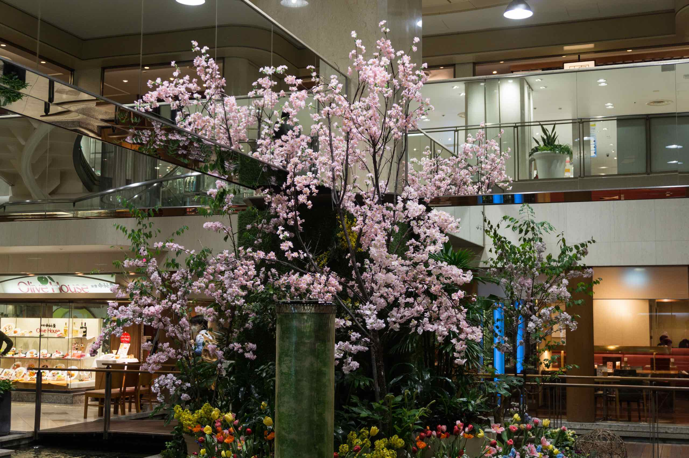
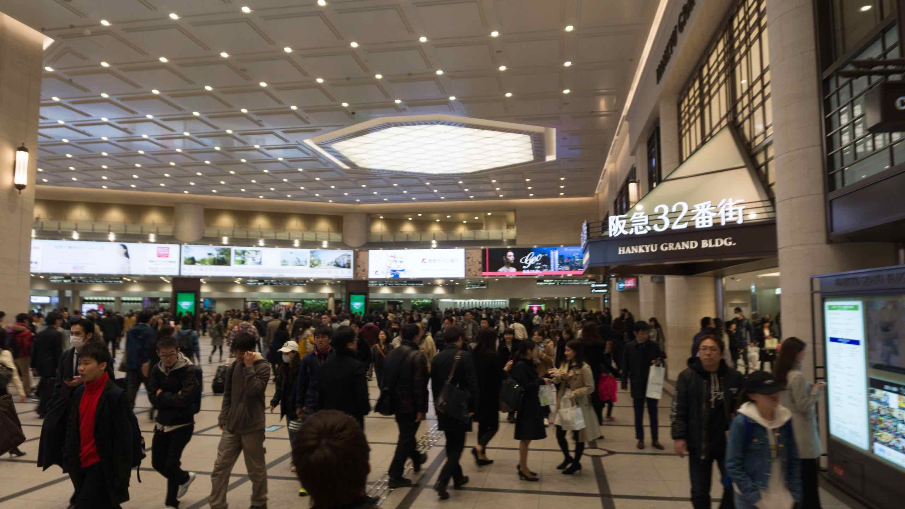
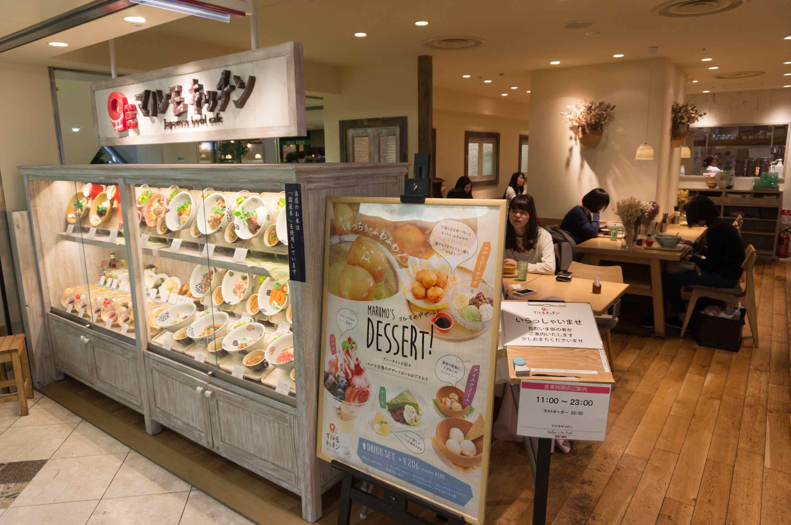
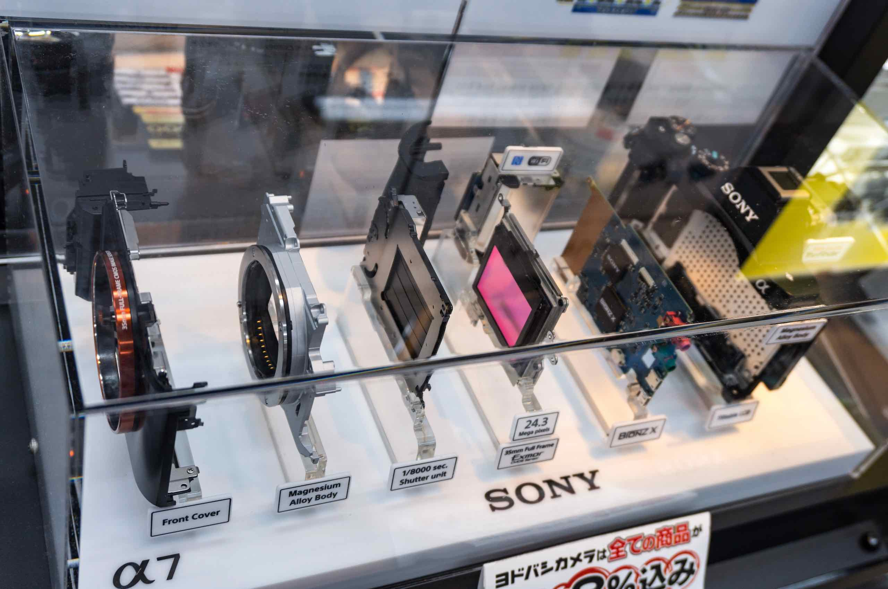

Osaka station is full of underground tunnels and we got lost in them – it was like a labyrinth and very hard to navigate as it was also rush hour.

We were staying in the posh end of town and I knew we had to get to the other side of the station for the cheap food. After what seemed to be forever, we fInally made it to Hankyu Sanban Gai, where the food is cheap zingy and come in generous helpings. I wasn’t feeling particularly hungry after the momiji cakes.

We settled for a cafe selling Japanese food in a bowl called Marumo. The menu was interesting and unusual and the food turned out to be delicious. I noticed eating there that the place is like a secret sisterhood – the staff and the clientele were 100% female – it was quite surreal. I guess the guys are not attracted to the type of food or the decor!

After dinner we got lost trying to head back to the hotel and accidentally stumbled into Yodobashi Camera – this is a huge store with well over 10 floors. We wandered around Yodobashi (I still remember their cute ad jingle -which they were rendering ever so subtly as background music but it was a synthesised Muzak version). The store announcements were impressive – after Japanese, Chinese and Mandarin there was a slew of other languages including Thai and French.

We got lost once again leaving Yodabashi but finally made it by going back to Osaka station, and retracing our steps back to the hotel. Exhausted I discovered we had done over 20000 steps wandering around the Osaka maze!
