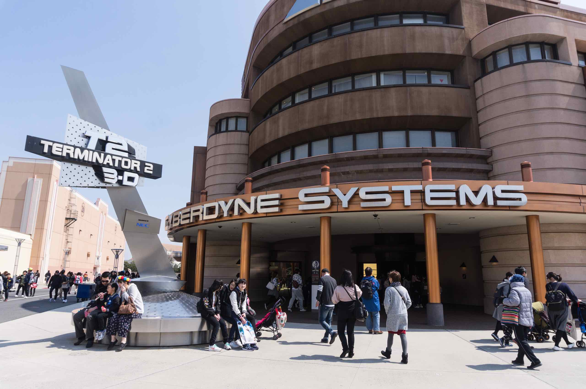

Despite not securing reserved seats, we managed to get a very good vantage point with excellent lighting so I hope my video will come out well when I process it at home.

<iframe width="560" height="315" src="https://www.youtube.com/embed/Dc8LTJuevk0" title="YouTube video player" frameborder="0" allow="accelerometer; autoplay; clipboard-write; encrypted-media; gyroscope; picture-in-picture; web-share" allowfullscreen></iframe>

Next I tried the Terminator 3D experience. I must admit, I wasn’t expecting more than the usual 3D blurry film and the waiting hall didn’t exactly inspire with cheesy low resolution TV screens. But apparently all that is intended and part of the scenario – that we are in the 80s when the Terminator films were made.

A woman doing the pre-show announcements in a bright red outfit (presumably as a member of staff at Cyberdyne Corporation) seemed to go on and on and vaguely irritating but I discovered that was all part of the show as well.
When were are finally seated in the theatre I was amazed. It wasn’t just a 3D movie with puny wind and seat shaking effects (although they had those as well). It was a mixture of 3D projected onto three gigantic 4K screens, seamlessly merged with live action and animatronics so it was almost virtual reality. And it was very satisfying to see the irritating usher/Cyberdyne rep getting crushed by the T1000.

When that finished it was almost time to leave. We took another tour through the theme park. The Jurassic ride is water based and quite splashy based on the drenched look of the participants. The roller coaster seems very terrifying with lots of twists turns and corkscrews. It also seemed like the participants are upside down for the majority of the ride – definitely stomach churning and not recommended after a heavy meal.
