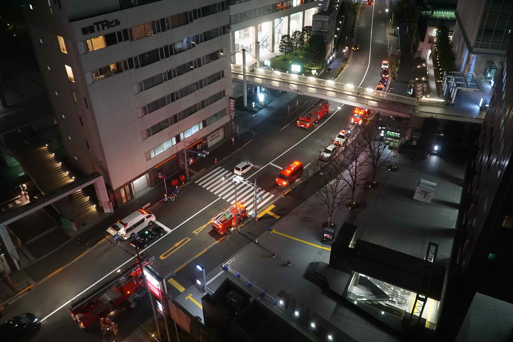

Today is our last day in Japan, and we are flying back to Sydney tonight.

Last night turned out to be quite eventful. First of all, we were woken up in the middle of the night by an announcement that came over the public address system. Apparently, the fire alarm has been triggered and they assured us that the fire department has checked it out and it was a false alarm.

I looked through the room window and there were lots of fire trucks parked along the street outside the hotel so they weren’t kidding!

Then at breakfast, the ambulance arrived and apparently someone has collapsed in the bathroom and had to be stretchered out.

After a leisurely breakfast, we checked out, and headed out to Shinjuku Gyoen. This is a huge park about 15 mins walk from the station. Even though it was still relatively early, there were already lots of people at the park.

I was surprised that the park charged an admission fee of 200 yen. Once we were inside though, it was worth it. Plenty of cherry blossoms, and lots of tourists like us taking photos. The Tokyo natives were smarter, they headed deeper into the park where the trees are more mature and the blossom is even more enticing.

The park was originally a residence of the Naitō family in the Edo period. Afterwards, it became a garden under the management of the Imperial Household Agency of Japan. It is now a national park under the jurisdiction of the Ministry of the Environment.

We spent pretty much the whole morning at the park, and there were lots to see, including a Japanese garden, a French formal garden and English landscape garden. A set of ponds are located in the middle of the park.
